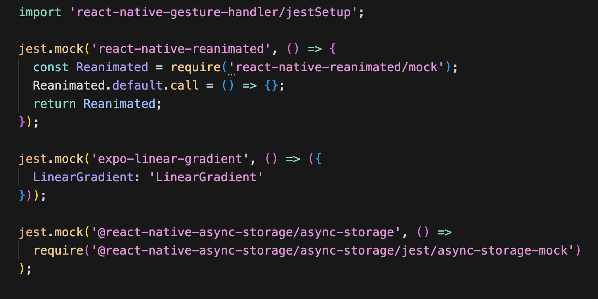
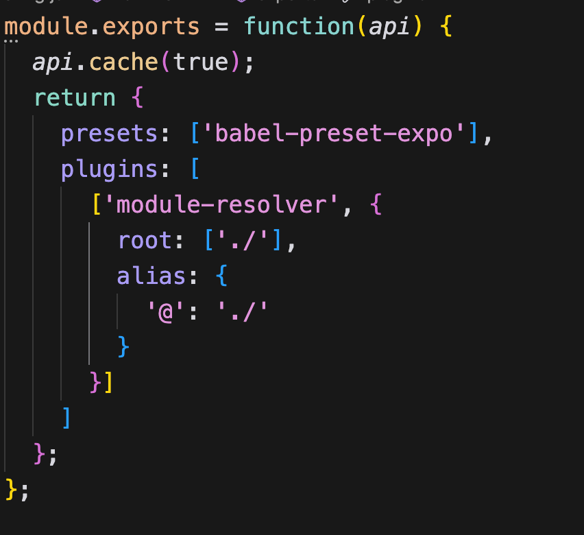
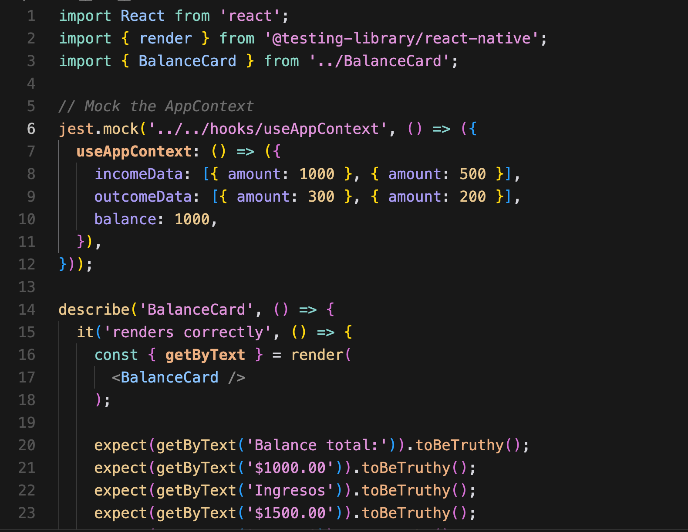

### Cosas q hacer para configurar el react native test library ###

1. Agregar en package.json todas las libraries que sean relacionadas a jest y dependencias de la libreria. Si se tiene un instalador de paquetes, ej.npm correr el comando

```  npm install --save-dev jest @testing-library/react-native @testing-library/jest-native```

2. Indicarle a jest todas las librerías que se están utilizando para q pueda parsearlo. jest.setup.js


Otra alternativa es agregar en el package.json:
```
  "jest": {
    "preset": "react-native",
    "setupFilesAfterEnv": ["@testing-library/jest-native/extend-expect"]
  },
```
Si se quiere especificar el archivo de configuración de jest:
```     jest --config nombreArchivo ```

3. Babbel permite traducir librerías de react native, las cuales jest no reconoce, o garantizar la compatibilidad.  babel.config.js
```npm install --save-dev @babel/plugin-transform-private-methods babel-preset-expo```


4. Agregar en la lista de scripts de package.json la opcion de test:
```
{
  "scripts": {
    "test": "jest"
  }
}
```

5. Escribir tus tests:
Crear archivos con estilo ComponentName.test.js:


**Usar @testing-library/react-native's:** 

- query methods como getByText, getByTestId, queryByText, etc., para buscar elementos especificos en tu render component. 
- Usar fireEvent para simular la interacion del usuario. 
- Si se usa mock, hay que renderizar usando mocks. 
- Cuando es la primera vez, tardan los tests al tener que subir los modulos. Pero una vez subidos, el tiempo se reduce significativamente.

6. Eliminar cache de jest:
```npx jest --clearCache```

7. Correr los tests:
```npm test``` 

Otra manera es:
```npx jest --verbose```  
permite ver mejor los errores. 

De un archivo especifico seria
```npm test -- components/__tests__/CategoryList.test.tsx```
```npm test -- components/__tests__/TransactionList.test.tsx```
```npm test -- components/__tests__/OutcomeList.test.tsx```
```npm test -- components/__tests__/BalanceCard.test.tsx```

8. Si todavia faltan dependencias:
```npm install```
